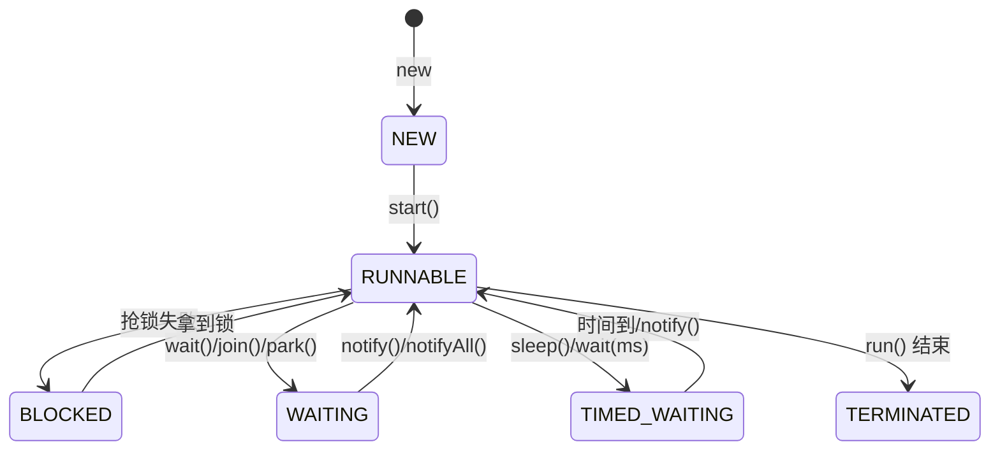
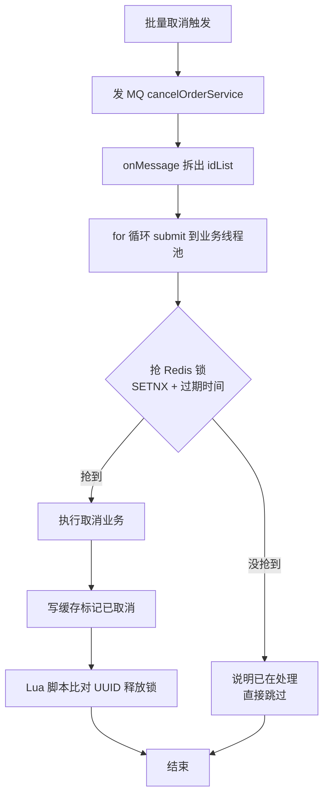
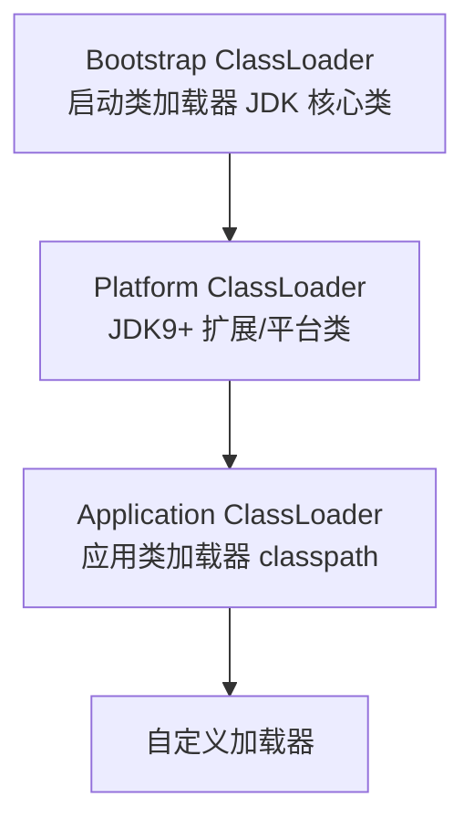
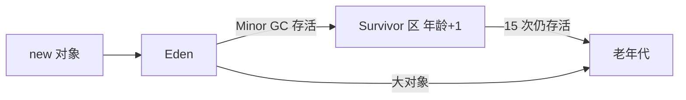

# Java 后端面试 Q&A 整理

> 标准面试答案整理。每个主题 = 面试官可能问的问题 + 回答，只讲原理与通用实践，不含项目细节。

---

## 目录

- [一、Java 基础](#一java-基础)
  - Q1 `==` 与 `equals` / Q2 基本类型与引用类型 / Q3 接口与抽象类 / Q4 面向对象 / Q5 集合
- [二、并发基础](#二并发基础)
  - Q6 进程与线程 / Q7 并行与并发 / Q8 创建线程四种方式 / Q9 Runnable 与 Callable / Q10 线程状态 / Q11 wait 与 sleep / Q12 释放锁的意义
- [三、锁](#三锁)
  - Q13 synchronized 底层 / Q14 JMM / Q15 AQS / Q16 volatile / Q17 ReentrantLock / Q18 Lock 与 synchronized / Q19 死锁代码 / Q20 锁的分类
- [四、线程池](#四线程池)
  - Q21 核心参数 / Q22 工作原理 / Q23 参数设置 / Q24 拒绝策略 / Q25 不用 Executors / Q26 优雅关闭
- [五、项目场景：下单与取消订单](#五项目场景下单与取消订单)
  - Q27 下单流程 / Q28 批量取消流程 / Q29 两流程对比
- [六、JVM 与线上排查](#六jvm-与线上排查)
  - Q30 内存结构 / Q31 类加载 / Q32 双亲委派 / Q33 判断垃圾 / Q34 回收算法 / Q35 回收器 / Q36 新生代老年代 / Q37 调优参数命令 / Q38 OOM 排查 / Q39 CPU 飙高 / Q40 死锁定位 / Q41 K8s 下 OOM / Q42 Pod 死亡处理
- [七、Redis 专题](#七redis-专题)
  - Q43 为什么快 / Q44 数据结构 / Q45 事务与 Lua / Q46 双写一致 / Q47 过期策略 / Q48 淘汰策略 / Q49 持久化 / Q50 穿透击穿雪崩 / Q51 分布式锁 / Q52 集群 / Q53 项目应用 / Q70 代码六种模式 / Q71 滑动窗口业务 / Q72 大 key 热 key / Q73 Redis 当 MQ / Q74 ZSet 延迟队列 / Q75 缓存更新策略
- [八、消息队列（MQ）专题](#八消息队列mq专题)
  - Q54 可靠性 / Q55 有序性 / Q56 防丢失 / Q57 防重复 / Q58 死信队列 / Q59 三 MQ 对比与选型 / Q60 底层原理 / Q61 ACK / Q62 线上问题 / Q63 积压排查 / Q64 项目 RocketMQ / Q65 短信排查 / Q66 生产者消费者概念 / Q67 手动 ACK / Q68 消费端积压 / Q69 生产者积压 / Q76 ACK 代码实现
- [九、MySQL 专题](#九mysql-专题)
  - Q77 索引原理 / Q78 EXPLAIN / Q79 索引失效 / Q80 联合索引最左前缀 / Q81 索引设计原则 / Q82 ACID / Q83 并发问题 / Q84 隔离级别 / Q85 MVCC / Q86 幻读解决 / Q87 锁分类 / Q88 行锁三种 / Q89 悲观乐观锁 / Q90 死锁 / Q91 三种日志 / Q92 redo vs binlog / Q93 两阶段提交
- [十、一句话速记](#十一句话速记)

---

## 一、Java 基础

### Q1. `==` 和 `equals()` 有什么区别？

**答**：

- `==`：对基本类型比较的是**数值**；对引用类型比较的是**引用地址**，即"是不是同一个对象"。
- `equals()`：比较的是**内容**，但前提是类重写了 equals。String、Integer、Long 等标准库类都重写了；自定义类如果不重写，`equals()` 默认行为和 `==` 一样（都比地址）。
- 经典坑：String 用 `==` 可能"碰巧"相等（字符串常量池 intern）；`Integer` 在 -128~127 之间有缓存，小值 `==` 会通过，超出范围就失效；从数据库、JSON 反序列化来的对象不参与缓存。所以比较内容一律用 `equals()`。
- 空指针安全写法：常量在前 `"abc".equals(x)`，或 `Objects.equals(a, b)`（两个参数都判空，不会 NPE）。

### Q2. 基本类型用 `==`，引用类型用 `equals`，这个说法对吗？

**答**：基本正确，但引用类型有四种情况必须/应该用 `==`：

1. **null 判断**：`x == null`，不能 `x.equals(null)`（会 NPE）。
2. **枚举比较**：JVM 保证枚举单例，`==` 是规范写法，和 `equals` 结果完全一致。
3. **Class 字面量比较**：`clazz == String.class`。
4. **故意比引用身份**：判断两个引用是否指向同一个对象。

### Q3. 接口和抽象类的区别？

**答**：

| | 接口 interface | 抽象类 abstract class |
|---|---|---|
| 本质 | 契约/能力声明（能做什么） | 半成品类（公共实现 + 扩展点） |
| 继承 | 一个类可实现多个接口 | 只能单继承 |
| 状态 | 不能有实例字段、构造器 | 可以有字段、构造器、具体方法 |
| 方法 | 抽象方法为主，Java 8+ 可有 default/static 方法 | 抽象方法 + 完整实现方法 |
| 语义 | can-do（具备什么能力） | is-a（是什么 + 骨架复用） |

选择原则：要"能力互换"用接口；要"公共代码复用 + 模板方法"用抽象类。最佳实践是组合：接口定契约，抽象类填公共实现，子类只写差异。

### Q4. 什么是面向对象？

**答**：把"数据"和"操作数据的方法"封装成对象，程序就是对象之间协作。四大特征：

- **封装**：隐藏内部实现，通过方法访问，可加校验。
- **继承**：子类复用父类属性和方法，表达 is-a 关系。
- **多态**：同一个方法在不同对象上表现不同，调用方只认接口不认实现。
- **抽象**：只关心"能做什么"，忽略细节（接口和抽象类就是抽象工具）。

### Q5. Java 常用集合的应用场景？

**答**：

| 集合 | 底层 | 场景 |
|---|---|---|
| ArrayList | Object[] | 默认首选：随机访问、遍历、尾部增删 |
| LinkedList | 双向链表 | 频繁头尾插入删除、当队列/栈用（队列更推荐 ArrayDeque） |
| HashSet | HashMap | 去重、contains 判断，不关心顺序 |
| TreeSet | TreeMap（红黑树） | 自动排序、范围查询（subSet/headSet/tailSet），O(log n) |
| HashMap | 数组+链表+红黑树 | 键值映射、分组、缓存，默认 Map 首选 |
| Hashtable | 数组+链表 | 历史遗留，方法全 synchronized，已被取代，不用 |
| ConcurrentHashMap | 数组+链表+红黑树 | 多线程共享读写的缓存、注册表、计数器 |

选型一句话：**无脑 ArrayList + HashMap；去重加 HashSet；排序/区间换 TreeSet；多线程共享换 ConcurrentHashMap；LinkedList 和 Hashtable 基本不用**。

---

## 二、并发基础

### Q6. 进程和线程的区别？

**答**：进程是操作系统**资源分配**的基本单位，有独立地址空间（堆、栈、代码段），进程间隔离；线程是 **CPU 调度执行**的基本单位，是进程内的执行流，共享进程的堆，各有独立栈和程序计数器。区别：资源独享 vs 共享、创建/切换开销大 vs 小、通信靠 IPC vs 共享内存+锁、进程隔离强 vs 一个线程崩溃影响整个进程。一句话：**进程是资源的容器，线程是容器里的执行流**。

### Q7. 并行和并发的区别？

**答**：并发是同一时间段内**交替执行**多个任务（宏观同时、微观轮流），**单核也能并发**，靠时间片切换；并行是同一时刻**真正同时执行**，必须多核 CPU。并发重点在"处理多个任务的能力"，并行重点在"同时执行"。

### Q8. 创建线程的四种方式？

**答**：

1. 继承 `Thread`，重写 `run()`；
2. 实现 `Runnable`，传给 `new Thread(runnable)`；
3. 实现 `Callable` + `FutureTask`，能拿返回值；
4. **线程池**（`ThreadPoolExecutor` / `ExecutorService`）——实际工作中 99% 用这个，避免频繁创建销毁线程，统一管理数量。

### Q9. Runnable 和 Callable 的区别？

**答**：

| | Runnable | Callable |
|---|---|---|
| 方法 | `void run()` | `V call()`，泛型 |
| 返回值 | 无 | 有，`Future.get()` 获取（阻塞） |
| 异常 | 不能抛受检异常，只能内部 try-catch | 可 `throws Exception`，抛给调用方（包装成 ExecutionException） |
| 使用 | Thread / `execute` | 必须配 FutureTask 或 `submit` |

### Q10. 线程的状态变化？

**答**：Java 线程 6 种状态：NEW（未 start）、RUNNABLE（就绪+运行，Java 不区分）、BLOCKED（抢 synchronized 锁失败）、WAITING（wait/join/park，无限期等待）、TIMED_WAITING（sleep/wait(ms)/join(ms)，限时等待）、TERMINATED（结束）。



易混点：**BLOCKED 是等 synchronized 的锁，WAITING 是等条件通知**。

### Q11. wait 和 sleep 的区别？

**答**：

| | wait | sleep |
|---|---|---|
| 归属 | Object 实例方法 | Thread 静态方法 |
| 释放锁 | **释放**当前锁 | **不释放**锁 |
| 前提 | 必须持有锁（synchronized 块内），否则抛 IllegalMonitorStateException | 不需要 |
| 唤醒 | notify()/notifyAll() 或超时 | 到点自动醒 |
| 用途 | 线程间通信/协调 | 单纯暂停 |
| 进入状态 | WAITING / TIMED_WAITING | TIMED_WAITING |

### Q12. wait 为什么要释放锁？不释放会怎样？

**答**：wait 释放锁是线程协作成立的前提。经典生产者-消费者：消费者发现队列空，调用 `wait()` 等待；如果不释放锁，生产者进不来、无法放数据、也就永远没人 `notify`，形成死锁。所以 wait 的语义是"我等你，但我不挡着你干活"。sleep 只是"暂停一会儿"，与协作无关，所以不释放锁；在持有锁时 sleep 会阻塞其他线程，是坏味道。细节：wait 被唤醒后要重新抢锁（先进入 BLOCKED）才能从 wait 返回。

---

## 三、锁

### Q13. synchronized 的底层原理？

**答**：synchronized 靠 JVM 的 Monitor（监视器锁）实现，锁状态记录在对象头的 Mark Word 里，有锁**升级**过程：

- **偏向锁**：只有一个线程反复获取，Mark Word 记录线程 ID，开销几乎为零（JDK 15 起默认禁用、JDK 18 已移除，面试提到要说明这点）；
- **轻量级锁**：多线程交替获取，CAS 自旋抢锁，开销小；
- **重量级锁**：多线程同时争抢，升级为操作系统互斥量，线程挂起/唤醒，开销大。

### Q14. JMM 是什么？

**答**：Java 内存模型（Java Memory Model），不是一个真实的内存区域，而是一套规则，定义多线程环境下**变量的修改什么时候能被其他线程看到**。核心模型：每个线程有自己的工作内存（变量副本），通过主内存同步；volatile、synchronized、final 等机制保证**可见性、原子性、有序性**。

### Q15. AQS 是什么？

**答**：AbstractQueuedSynchronizer，一个**排队框架**——拿不到锁的线程自动进入 CLH 队列排队挂起，锁释放后自动唤醒下一个线程。使用者只需要实现"什么情况下算拿到锁"（tryAcquire/tryRelease），剩下的排队、挂起、唤醒都由 AQS 完成。ReentrantLock、CountDownLatch、Semaphore 都基于它。

### Q16. volatile 的作用？

**答**：两个作用：**保证内存可见性**（写操作立即刷回主内存，读操作从主内存读）和**防止指令重排序**（内存屏障）。注意它**不保证原子性**，`i++` 这类复合操作仍需加锁或用 Atomic 类。

### Q17. ReentrantLock 的实现原理？

**答**：基于 AQS，核心是 **CAS 操作 state 变量 + CLH 队列排队**。加锁：先 CAS 把 state 从 0 变 1，成功即拿到锁；失败进入队列排队挂起。可重入：同一个线程再次加锁，state 累加。释放锁：state 递减，减到 0 才真正释放，并唤醒队列中的下一个线程。相比 synchronized 多了**可中断、可超时、公平锁、多条件变量**，但需要手动在 finally 里 unlock。

### Q18. Lock 和 synchronized 的区别？

**答**：

| | synchronized | Lock（ReentrantLock） |
|---|---|---|
| 层级 | JVM 关键字，Monitor | JDK 接口，AQS |
| 释放 | 自动释放，异常也释放 | 必须手动 unlock，放 finally |
| 中断 | 等待锁时不可中断 | lockInterruptibly() 可响应中断 |
| 超时 | 不支持 | tryLock(timeout) |
| 公平 | 非公平 | 可指定公平锁 |
| 条件变量 | 只有 wait/notify 一套 | 多个 Condition，精确唤醒 |

一句话：**功能上 Lock 更丰富，synchronized 胜在简单省心**；需要超时、中断、公平、精确唤醒才用 Lock。

### Q19. 写一段死锁代码？

**答**：两个线程持锁顺序相反，形成循环等待：

```java
public class DeadlockDemo {
    private static final Object LOCK_A = new Object();
    private static final Object LOCK_B = new Object();

    public static void main(String[] args) {
        new Thread(() -> {
            synchronized (LOCK_A) {
                System.out.println("t1 持有 A，等待 B");
                sleep(100);
                synchronized (LOCK_B) { }   // 永远等不到
            }
        }, "t1").start();

        new Thread(() -> {
            synchronized (LOCK_B) {
                System.out.println("t2 持有 B，等待 A");
                sleep(100);
                synchronized (LOCK_A) { }   // 永远等不到
            }
        }, "t2").start();
    }

    private static void sleep(long ms) {
        try { Thread.sleep(ms); } catch (InterruptedException ignored) { }
    }
}
```

死锁四条件：**互斥、持有并等待、不可剥夺、循环等待**。用 `jstack` 能看到 `Found one Java-level deadlock`。修复：所有线程按统一顺序拿锁（打破循环等待）；兜底用 `tryLock` 加超时，拿不到就放弃。

### Q20. 锁有哪些分类？分别用在什么场景？

**答**：

- **本地锁（synchronized / ReentrantLock）**：解决**单实例内**多线程竞争，如序号生成、保护非线程安全的工具类、状态流转串行化。
- **分布式锁（Redis Redisson / ZooKeeper）**：解决**多实例部署**下"检查-修改-写回"的全局唯一，如生成唯一单号、防重复提交、库存扣减。标准写法：`lock()` → `try/finally` → `unlock()`，锁粒度按业务 key，不要全局一把锁。
- 分布式锁注意点：设置过期时间（防死锁）、释放时校验持有者（防误删别人的锁）、考虑锁续期。

---

## 四、线程池

### Q21. 线程池的核心参数有哪些？

**答**：7 个核心参数：

| 参数 | 含义 |
|---|---|
| corePoolSize | 核心线程数，常驻，默认空闲不回收 |
| maximumPoolSize | 最大线程数 |
| keepAliveTime + TimeUnit | 临时线程（超过核心数的部分）空闲多久被回收 |
| workQueue | 工作队列：ArrayBlockingQueue（有界数组）、LinkedBlockingQueue（链表，可无界）、DelayQueue（延迟）、SynchronousQueue（不缓存，直接交线程） |
| threadFactory | 线程工厂：设置线程名、优先级、是否 daemon |
| rejectedExecutionHandler | 拒绝策略 |

### Q22. 线程池的工作原理？

**答**：**四级分流**。提交任务后：

1. 核心线程未满 → 创建核心线程直接执行；
2. 核心线程满 → 任务进**工作队列**排队；
3. 队列满 → 创建**临时线程**执行（注意：临时线程是队列满之后才创建，不是核心满就建）；
4. 线程数已达最大值且队列满 → 触发**拒绝策略**。

补充：临时线程空闲超过 keepAliveTime 被回收，核心线程默认不回收（除非 allowCoreThreadTimeOut）；线程池内部用 `ctl`（AtomicInteger）同时记录线程数和状态（RUNNING / SHUTDOWN / STOP / TIDYING / TERMINATED），用 CAS 保证并发安全。高频考点：核心线程都在忙、队列没满时，新任务**不会**创建临时线程，而是全部排队。

### Q23. 线程池的参数怎么设置？

**答**：先分类估算，公式只是起点，最终靠**压测验证 + 监控调整**：

- **CPU 密集型**：`CPU 核数 + 1`。多出的 1 个防止线程因页缺失、GC 停顿导致 CPU 空转。
- **IO 密集型**：`CPU 核数 × 2`，或更精确的 `CPU 核数 / (1 - 阻塞系数)`（阻塞系数一般取 0.8~0.9）。因为等待 IO 时线程释放 CPU，多开线程能提高吞吐。
- **队列**：必须**有界**（无界会导致任务无限堆积、OOM）。容量看任务峰值和可接受的排队延迟（队列长度 × 单任务耗时 ≈ 排队延迟）。
- **keepAliveTime**：一般 30~60 秒，太长浪费资源、太短频繁创建销毁线程。
- **线程工厂**：必须给线程起名字（如 `order-`），否则排查问题时 jstack 全是 pool-1-thread-1。
- **拒绝策略**：按业务容忍度选择（见 Q24）。
- **最后**：压测找到吞吐拐点，配合监控（活跃线程数、队列积压、拒绝次数）动态调整，或接动态线程池框架运行时调参。

### Q24. 拒绝策略有哪几种？默认是哪个？哪个好？

**答**：四种内置策略：

| 策略 | 行为 | 场景 |
|---|---|---|
| AbortPolicy（**默认**） | 抛 RejectedExecutionException | 对外接口、需要快速失败 + 告警 |
| CallerRunsPolicy | 由**提交任务的调用者线程**自己执行 | 任务不能丢（订单、支付、消息），**最推荐** |
| DiscardPolicy | 静默丢弃新任务 | 日志、埋点等可丢任务 |
| DiscardOldestPolicy | 丢弃队列里最老的任务，再提交当前任务 | 追求最新数据（实时推送快照） |

默认是 **AbortPolicy**（Executors 工厂方法和 Spring 的 ThreadPoolTaskExecutor 默认都是它）。**最推荐 CallerRunsPolicy**，两个优点：① 不丢任务；② 自带背压——调用者线程被占住，提交方自然变慢，从源头限流。代价是吞吐下降。也可以实现自定义 RejectedExecutionHandler（如记录指标 + 告警）。

### Q25. 为什么不建议用 Executors 工厂方法创建线程池？

**答**：因为 Executors 的快捷方法都有隐患（阿里规约明确禁止）：

| 方法 | 问题 |
|---|---|
| newFixedThreadPool / newSingleThreadExecutor | 无界 LinkedBlockingQueue，任务无限堆积，OOM |
| newCachedThreadPool | 最大线程数 Integer.MAX_VALUE，狂来任务会创建海量线程，OOM |
| newScheduledThreadPool | 无界队列，且任务异常被吞 |

正确做法：**手动 new ThreadPoolExecutor / ThreadPoolTaskExecutor**，显式指定有界队列、核心/最大线程数、命名线程工厂、拒绝策略。

### Q26. 线程池怎么优雅关闭？

**答**：`shutdown()` 不再接受新任务，等已提交任务执行完；`shutdownNow()` 立即中断所有任务并返回未执行任务列表。工程上配合 `awaitTermination(timeout)` 等待；Spring 的 ThreadPoolTaskExecutor 可配置 `setWaitForTasksToCompleteOnShutdown(true)` + `setAwaitTerminationSeconds(60)`，容器关闭时先让任务跑完，超时才强制结束。

---

## 五、项目场景：下单与取消订单

### Q27. 讲一下你项目的下单流程？

**答**：下单是**同步关键路径**，用户要即时拿到订单号和结果：


核心逻辑（`saveOrder`）：生成订单 UUID → 按需加运费明细 → **调用远程订单号服务生成唯一订单号** → 状态置为未支付 → 落库 → 记日志。

**订单号生成必须用分布式锁**：订单号规则通常是"前缀 + 日期 + 自增序号"，序号存在 Redis 里。多实例并发下单时，"读序号 → +1 → 写回"不是原子的，不加锁会生成重复单号。所以订单号服务内部用分布式锁把这段串行化，保证全局唯一。支付成功后发 MQ，由消费者线程池异步做价格计算/结算——**主链路同步、计算异步**。

### Q28. 讲一下你项目的批量取消订单流程？

**答**：批量取消走的是**异步 MQ + 线程池 + 分布式锁**，和下单正好相反。

触发方：合同下未到检的服务单要批量取消时，**逐条调用容易超时，所以组装成 `{idList, key}` 发到 MQ**：

```java
Map<String, List<String>> map = new HashMap<>();
map.put("idList", collect);                       // 一批服务单 id
map.put("key", Collections.singletonList(contractId));
mqService.send("cancelOrderService", JSON.toJSONString(map));
```

消费方完整流程：



```java
taskExecutor.submit(() -> {
    String lockKey = "contractCancelOrderTask:" + id;   // 每个订单一把锁
    String uniqueId = UUID.randomUUID().toString();     // 锁持有者标识
    if (acquireLock(lockKey, uniqueId)) {               // SETNX + 过期时间
        orderPeServiceService.cancelService(id, true);  // 真正取消
        redisService.setCacheObject(redisKey, true, ...); // 标记已取消
    }
    // finally: Lua 比对 uniqueId 再释放锁
});
```

设计要点：

- **幂等**：MQ 是 at-least-once 投递，可能重复消费；同一订单同时只允许一个线程处理，靠 Redis 锁保证。
- **锁粒度是订单 id**：`contractCancelOrderTask:{id}` 每单一把锁，不同订单完全并行。
- **快速 ack**：`onMessage` 只拆包 + submit 就返回，消费线程不被长任务占住，消息不积压。
- **背压**：线程池满时走 CallerRunsPolicy，消费线程自己执行，宁可慢不丢消息。
- **防死锁 + 防误删**：锁带过期时间兜底（防线程挂了死锁）；释放时 Lua 比对 UUID 再删（防把别人的锁删掉）。

### Q29. 下单和取消订单两个流程的设计对比？

**答**：

| | 下单 | 批量取消 |
|---|---|---|
| 链路 | 同步（用户要等结果） | 异步（MQ + 线程池） |
| 锁的作用 | 订单号全局唯一 | 幂等防重复处理 |
| 并发手段 | 订单号服务内部串行化 | 线程池并发 + 每单一把锁 |
| 设计原因 | 必须同步返回订单号和结果 | 批量逐条调用易超时，MQ 削峰 |

一句话：**下单用"同步 + 分布式锁"保证唯一和即时；批量取消用"MQ + 线程池 + 每单一把 Redis 锁"实现削峰、并发和幂等**。这两个流程能把线程池、MQ、分布式锁全部串起来讲。

---

## 六、JVM 与线上排查

### Q30. JVM 的内存结构组成？

**答**：JVM 由三大部分组成：

- **类加载子系统**：把 class 字节码加载进 JVM。
- **运行时数据区**：
  - **方法区**：存类信息、常量、静态变量。JDK7 前叫永久代（在堆里，易 OOM），**JDK8 起改为元空间（Metaspace），使用本地内存**；JDK7 起字符串常量池已移到堆。
  - **堆**：对象实例，GC 主战场。
  - **虚拟机栈**：方法调用栈，存局部变量、操作数栈；栈溢出抛 StackOverflowError。
  - **本地方法栈**：native 方法调用。
  - **程序计数器**：记录字节码执行行号，**唯一不会 OOM 的区域**。
  - 线程私有：程序计数器、虚拟机栈、本地方法栈；线程共享：堆、方法区。
- **执行引擎**：解释器（逐行翻译，启动快）+ JIT 即时编译器（把热点代码编译成机器码，运行快）+ 垃圾回收器。HotSpot 的名字就来自热点探测。

### Q31. 类的加载过程？

**答**：7 个阶段：

1. **加载**：通过全限定名获取二进制字节流，在堆中生成 Class 对象；
2. **验证**：检查字节码是否符合规范，防止恶意代码；
3. **准备**：为静态变量分配内存并设置**默认值**（0/null）；`static final` 常量直接赋初始值；
4. **解析**：把符号引用替换为直接引用；
5. **初始化**：执行类构造器 `<clinit>()`，只有**主动使用**才触发（new、反射、访问静态方法/字段、main 所在类）；
6. **使用**；
7. **卸载**。

细节：验证 + 准备 + 解析合称**链接（Linking）**。

### Q32. 什么是双亲委派机制？为什么？怎么打破？

**答**：加载一个类时，先**委托给父加载器加载**，父加载器加载不了才自己加载。层级：



**意义**：① 安全——防止自定义类篡改 `java.lang.String` 等核心类；② 避免重复加载。

**打破场景**：SPI（JDBC 的 DriverManager）、Tomcat 容器（每个 webapp 独立类加载器）、热部署。面试提到 JDK9 起扩展类加载器改名 Platform ClassLoader 是加分项。

### Q33. 如何判断对象是不是垃圾？

**答**：两种算法：

- **引用计数法**：对象被引用则计数 +1，为 0 即垃圾。缺陷：**无法解决循环引用**（A 引用 B、B 引用 A，互相保命）。
- **可达性分析**（主流）：从 **GC Roots** 出发向下遍历，不可达的对象就是垃圾。GC Roots = 虚拟机栈引用的对象、静态变量引用的对象、常量池引用、JNI（native 方法）引用。

### Q34. 垃圾回收算法有哪些？

**答**：

| 算法 | 原理 | 特点 | 用在哪 |
|---|---|---|---|
| 标记-清除 | 标记垃圾后清除 | 简单，但**产生内存碎片** | CMS |
| 复制算法 | 把存活对象复制到另一块空间，整体清空 | 无碎片、快，但**浪费一半空间** | 新生代 |
| 标记-整理 | 标记后把存活对象往一端移动再清理 | 无碎片、无浪费，但**移动对象开销大** | 老年代 |

### Q35. JVM 有哪些垃圾回收器？

**答**：

- **Serial**：串行，单线程，适合小内存、客户端。
- **Parallel**：并行，多线程，吞吐优先，JDK8 默认。
- **CMS**：并发标记-清除，低停顿，JDK9 标记废弃、**JDK14 已移除**。
- **G1**：Region 分区，可预测停顿，**JDK9 起默认**。
- **ZGC**：超低延迟（毫秒级），JDK15+ 可用，JDK21 已成熟。

面试补充：G1 把堆分成多个 Region，优先回收垃圾最多的区域（Garbage First），用 `-XX:MaxGCPauseMillis` 控制停顿目标。

### Q36. 新生代和老年代的区别？对象的一生？

**答**：堆按对象存活时间分代：

- **新生代**：放"朝生夕死"的对象，分 Eden + 两个 Survivor（默认 8:1:1），用复制算法做 Minor GC，频繁但快。
- **老年代**：放长期存活的对象，来源：① 对象在 Survivor 复制 15 次（`-XX:MaxTenuringThreshold`）后晋升；② **大对象直接进老年代**；③ Survivor 装不下溢出晋升。用标记-清除/整理算法，GC 频率低但耗时长（Major/Full GC）。



**为什么分代**：绝大多数对象活不过第一次 GC，分代后新生代小、复制算法快，老年代少 GC，避免频繁全堆扫描。默认老年代:新生代 = 2:1（`-XX:NewRatio=2`）。

### Q37. JVM 调优的参数和命令有哪些？

**答**：

常用参数：

| 参数 | 作用 |
|---|---|
| `-Xms` / `-Xmx` | 初始堆 / 最大堆（生产建议相同，避免扩容） |
| `-Xss` | 虚拟机栈大小（默认约 1MB，递归深可调大） |
| `-Xmn` / `-XX:NewRatio` | 新生代大小 / 老年代占比 |
| `-XX:MetaspaceSize` | 元空间初始大小 |
| `-XX:+UseG1GC` / `-XX:MaxGCPauseMillis` | 选 GC 器 / 目标停顿 |
| `-XX:+HeapDumpOnOutOfMemoryError` | OOM 自动 dump（排查必备） |
| `-XX:+ExitOnOutOfMemoryError` | 堆 OOM 时 JVM 主动退出（配合 K8s 重启） |
| `-XX:+UseContainerSupport` | 容器感知内存/CPU（JDK8u191+ 默认开启） |

命令：**jps**（进程）、**jstack**（线程栈，死锁/CPU 高）、**jmap**（堆 dump / 堆信息）、**jstat**（GC 统计）、**jinfo**（参数）、**jcmd**（万能）、**jhat**（过时，分析用 MAT）。线上神器：**Arthas**。

方法论：**先看现象再调参**——CPU 高先 jstack，内存高先 jstat/jmap，定位到根因再调，调完压测验证。

### Q38. 线上 OOM 怎么定位和解决？

**答**：原则：**先保命、再留证、后破案**。

1. **保命**：立即重启/扩容/摘流量恢复服务（但重启只缓解，泄漏会复现）；
2. **留证**：提前配 `-XX:+HeapDumpOnOutOfMemoryError -XX:HeapDumpPath=...`；没配就用 `jmap -dump:format=b,file=heap.hprof <pid>` 手动抓（会 STW，大堆慎用）；
3. **观察**：`jmap -heap` 看各区水位、`jstat -gcutil` 看 GC 频率，判断是"不够用"还是"异常占用"；
4. **分析**：MAT 打开 hprof，看 **Leak Suspects**（泄漏嫌疑 + GC Roots 引用链）和 **Dominator Tree**（占用最大的对象）；
5. **根因**：超大 List（分页）、集合只加不减（限容量/清理）、ThreadLocal 未 remove（线程池复用泄漏）、缓存无界增长（LRU/过期）、连接未关闭（try-with-resources）。

注意区分：`Java heap space`、`Metaspace`、`Direct buffer memory`、`GC overhead limit exceeded` 是不同类型的 OOM。

### Q39. 线上 CPU 飙高怎么定位？

**答**：三命令定位法：

```bash
top                 # ① 找 CPU 最高的 Java 进程 PID
top -H -p <PID>     # ② 找进程内最耗 CPU 的线程 ID（十进制）
printf "%x\n" <tid> # ③ 转十六进制（jstack 里 nid 是十六进制）
jstack <PID> | grep -A 20 <十六进制tid>  # ④ 定位到具体代码行
```

多打几次 jstack，如果某线程一直卡在同一位置，基本就是问题线程。CPU 高的常见原因：死循环、频繁 Full GC、正则回溯、大对象序列化、自旋等待。

### Q40. 线上死锁怎么定位和避免？

**答**：`jstack <pid>` 输出会直接出现 **`Found one Java-level deadlock`**，并标明每个线程 `locked` 什么、`waiting to lock` 什么，顺着栈定位到代码行。

死锁四条件（同时满足）：**互斥、持有并等待、不可剥夺、循环等待**。避免就是破坏任意一个：无锁化（Atomic/CAS）、一次性申请全部资源、`tryLock(timeout)` 超时放弃、**按固定顺序加锁**打破循环等待。

### Q41. 服务部署在 K8s 上，OOM 挂掉，K8s 会干什么？

**答**：先分清两种 OOM：

| | JVM 堆 OOM | 容器 OOM Kill |
|---|---|---|
| 触发 | 堆内存不够，抛 OutOfMemoryError | 超过 resources.limits.memory |
| 进程 | JVM 默认**不退出** | 内核 OOM Killer SIGKILL |
| 退出码 | 无 | 137（128+9） |
| K8s 反应 | 默认**不重启** | 按 restartPolicy 重启容器 |

容器 OOM Kill 后：kubelet 检测到容器退出 → 按 `restartPolicy: Always` 自动重启容器 → 反复崩溃进入 **CrashLoopBackOff**（10s→20s→…→5min 指数退避）→ Pod 就绪后通过 Service 重新接流量。

要让 K8s 能处理 JVM 堆 OOM，需要 `-XX:+ExitOnOutOfMemoryError`（堆 OOM 主动退出触发重启）或配 liveness 探针。注意：容器 OOM Kill 是 SIGKILL，**JVM 来不及执行 heap dump**，heap dump 只在 JVM 内部堆 OOM 时有效。

### Q42. K8s 的 Pod 突然挂了，K8s 内部怎么处理？

**答**：核心是**控制器调谐循环**（期望状态 vs 实际状态，不一致就自动纠正）：

- **容器崩溃**（进程退出）：节点上的 **kubelet** 按 restartPolicy 重启容器（Always 重启 / OnFailure 非零退出才重启 / Never 不重启），反复崩溃进入 CrashLoopBackOff；
- **Pod 被删/驱逐**：**ReplicaSet 控制器**发现副本数不足 → 创建新 Pod → **调度器**选节点 → 拉镜像 → 启动 → 探针通过后接入 Service；
- **节点故障**：**Node Controller** 标记 NotReady（宽限+驱逐超时最长 5 分钟）→ 驱逐 Pod → 其他节点重建；
- **探针**：liveness 失败 → 杀容器重启；readiness 失败 → 只摘流量不重启。

排查：`kubectl get pods`（看 RESTARTS）、`kubectl describe pod`（看 Events 和 Last State）、`kubectl logs --previous`（崩溃前日志）。

---

## 七、Redis 专题

### Q43. Redis 为什么这么快？

**答**：三个原因：① **基于内存**，读写纳秒级；② **单线程**执行命令，避免了锁竞争和线程上下文切换；③ **IO 多路复用**（epoll 事件驱动），一个线程可以处理海量连接。注意两点：Redis 6.0+ 的多线程**只负责网络读写，命令执行仍是单线程**；单线程的瓶颈是 KEYS、大 key 这类 O(n) 命令。

### Q44. Redis 有哪些数据结构？底层实现和应用场景？

**答**：

| 类型 | 底层实现 | 应用场景 |
|---|---|---|
| string | SDS 简单动态字符串 | 缓存、计数器、分布式锁 |
| hash | dict；小数据用 ziplist/listpack | 对象字段存储（可只改一个字段） |
| list | quicklist（Redis 7 用 listpack） | 消息队列、最新列表 |
| set | intset + dict | 去重、共同好友、随机抽奖 |
| zset | 跳表 skiplist + dict | 排行榜、延迟队列、滑动窗口限流 |

### Q45. Redis 事务和 Lua 脚本的区别？

**答**：

- **MULTI/EXEC**：多条命令打包，EXEC 时一次性按顺序执行，中间不被其他命令打断；但**不支持回滚**（运行时错误其他命令照常执行，语法错误则整批不执行）。配合 **WATCH** 可实现乐观锁。
- **Lua 脚本**：一段逻辑在 Redis 服务端原子执行，判断和操作之间不会被插队，比 MULTI/EXEC 灵活。
- 选型：需要逻辑判断的场景（如分布式锁释放、扣库存防超卖）用 Lua；简单批量执行用 MULTI/EXEC。

### Q46. 缓存和数据库双写一致性怎么保证？

**答**：标准 **Cache Aside**：读缓存 → miss 查库 → 写缓存；写操作**先更新数据库，再删缓存**（而不是更新缓存），下次读时重建。

进一步方案：

- **延迟双删**：删缓存 → 改库 → 等 N 毫秒 → 再删缓存，解决"改库期间读请求把旧值写回缓存"的窗口；
- **删除失败重试**：删缓存失败必须靠 MQ 异步重试或定时任务兜底；
- **Canal/binlog 订阅**：伪装成 MySQL 从库监听 binlog，数据变更自动删缓存，业务无侵入，最终一致。

结论：缓存一致性没有银弹，只能**最终一致 + 兜底**。

### Q47. Redis 的过期删除策略？

**答**：三种，Redis 用的是前两种组合：

- **惰性删除**：访问 key 时才检查是否过期，过期就删。省 CPU，但过期 key 一直不访问就占着内存。
- **定期删除**：每隔 100ms 随机抽查一部分 key，删除过期的。折中。
- **定时删除**：每个 key 建定时器到期立即删。CPU 不友好，Redis 不用。

### Q48. Redis 内存淘汰策略？

**答**：`maxmemory-policy` 共 8 种：`noeviction`、`allkeys-lru`、`allkeys-lfu`、`allkeys-random`、`volatile-lru`、`volatile-lfu`、`volatile-random`、`volatile-ttl`。生产常用 **allkeys-lru**（近似 LRU，抽样淘汰，性能好、效果接近精确 LRU）；Redis 4.0+ 支持 LFU（按访问频率）。

### Q49. Redis 持久化机制？

**答**：

- **RDB**：fork 子进程把内存全量快照写入磁盘（写时复制 COW）。触发：save（同步）、bgsave（异步）、配置定时（`save 900 1 / 300 10 / 60 10000`）。优点：文件小、恢复快；缺点：两次快照之间丢数据。
- **AOF**：把每条写命令追加到文件。写回策略：`always`（每条刷盘，最安全最慢）、`everysec`（每秒刷，默认折中）、`no`（操作系统决定）。优点：最多丢 1 秒数据；缺点：文件大、恢复慢。文件膨胀后靠 `bgrewriteaof` 重写。
- **混合持久化**（4.0+，`aof-use-rdb-preamble`）：RDB 头 + AOF 尾，重启恢复快且丢得少。**恢复优先级 AOF > RDB**。

### Q50. 缓存穿透、击穿、雪崩的区别和解决？

**答**：

| 问题 | 现象 | 解决 |
|---|---|---|
| 穿透 | 缓存和数据库都没有，请求全打库 | 缓存空值（短过期）、布隆过滤器 |
| 击穿 | 单个热点 key 过期，大量请求同时打库 | 互斥锁重建缓存、逻辑过期异步刷新 |
| 雪崩 | 大量 key 同时过期或 Redis 宕机 | 过期时间加随机值、多级缓存、限流降级、集群高可用 |

### Q51. Redis 分布式锁怎么实现？

**答**：标准三件套：

1. **加锁**：`set key value NX PX`（单命令原子，不存在才写 + 带过期时间防死锁）；
2. **释放**：Lua 脚本先比对 value（UUID）再删除，防止误删别人的锁；
3. **看门狗**：Redisson 默认 30 秒，业务没跑完自动续期。

注意：Redis 主从切换可能丢锁（AP），官方 RedLock 方案有争议；追求强一致用 ZooKeeper（CP，临时顺序节点）。项目实践用 Redisson RLock + 业务 key 粒度。

### Q52. Redis 集群（主从/哨兵/分片）？

**答**：

- **主从**：解决数据备份和读写分离。全量复制（RDB）+ 增量复制（repl_backlog 环形缓冲）；主从有延迟。
- **哨兵**：在主从基础上解决高可用，自动故障转移。至少 3 个哨兵防脑裂，主观下线 → 客观下线 → 选举新主。
- **Cluster 分片**：在哨兵基础上解决水平扩展。**16384 个 slot**，`CRC16(key) % 16384` 路由，客户端收到 MOVED/ASK 跳转；跨 slot 多 key 操作不支持。

### Q53. 你的项目里 Redis 用在了哪些场景？

**答**：

- **五种结构都用**：string（缓存、计数器 `incr`、分布式锁 `setIfAbsent`）、hash（对象字段存储）、list（列表/队列，`lPush` 用管道合并 EXPIRE）、set（去重）、**zset**（滑动窗口去重/频控，Lua + zset 实现）。
- **Lua 脚本三处**：分布式锁释放（比对 UUID 再删）、**扣库存防超卖**（判断库存 ≥ 需求量再 DECRBY）、滑动窗口限流（zadd + zremrangebyscore + zcard）。
- **分布式锁**：Redisson RLock（70 处，看门狗续期）+ SETNX（9 处，带过期时间）+ 手写 RedisDistributedLock（SETNX + Lua + 失败重试）。
- **缓存一致性**：标准 Cache Aside，字典缓存用"改库后删缓存、下次读重建"；登出删 token 缓存。**没有用 Canal**、没有延迟双删。
- **没用到的**：布隆过滤器（穿透防护未用）、ZSet 排行榜/延迟队列、随机过期时间防雪崩、多级缓存。
- 配置注意：连接池、淘汰策略、持久化配置在 Nacos 的 `redis.yml`；项目里 `limit.lua` 文件在仓库缺失，运行时可能加载失败，需确认。

### Q70. 项目里 Redis 的代码具体是怎么用的？（六种模式）

**答**：项目所有 Redis 操作都走统一封装 [RedisService](/Users/zhoumin/work/yunpingtai/healthy-healthy-jdk21-from-main-deploy-260425/healthy-common/healthy-common-redis/src/main/java/com/healthy/common/redis/service/RedisService.java)，业务代码不直接碰 RedisTemplate。六种使用模式：

**① 缓存读写（Cache Aside）**：字典缓存 [DictUtils](/Users/zhoumin/work/yunpingtai/healthy-healthy-jdk21-from-main-deploy-260425/healthy-common/healthy-common-security/src/main/java/com/healthy/common/security/utils/DictUtils.java:35) 先 `getCacheObject` 查缓存，miss 后查库写缓存，改数据时 `deleteObject` 删缓存；登录 token 用 [SysAuthTokenService](/Users/zhoumin/work/yunpingtai/healthy-healthy-jdk21-from-main-deploy-260425/healthy-common/healthy-common-security/src/main/java/com/healthy/common/security/service/SysAuthTokenService.java:112) 写入带过期时间，登出删除、临近过期自动续期。

**② SETNX 分布式锁（防并发修改/幂等）**：[OrderController](/Users/zhoumin/work/yunpingtai/healthy-healthy-jdk21-from-main-deploy-260425/healthy-modules/healthy-shop/src/main/java/com/healthy/order/controller/OrderController.java:321) 的标准模板：

```java
String lockKey = "update_order_" + order.getId();   // 按订单粒度
String lockValue = UUID.fastUUID().toString();       // 防误删
lockAcquired = redisService.setIfAbsent(lockKey, lockValue, 30, TimeUnit.SECONDS);
if (!lockAcquired) return AjaxResult.error("系统繁忙，请稍后再试");
try { /* 业务 */ } finally {
    if (lockAcquired) redisService.unlock(lockKey, lockValue);  // Lua 比对 UUID 删
}
```

MQ 消费者（取消订单、推 OA）用同一模板做**幂等**，锁 key 为 `contractCancelOrderTask:{id}`、`order:peoa:lock:{id}`。

**③ Redisson 锁（全局唯一单号）**：[UnicodeServiceImpl](/Users/zhoumin/work/yunpingtai/healthy-healthy-jdk21-from-main-deploy-260425/healthy-modules/healthy-system/src/main/java/com/healthy/system/service/impl/UnicodeServiceImpl.java:58) 用 `RLock` + `lock()/unlock()` 把"读 Redis 序号 → +1 → 写回"串行化，多实例不生成重复单号，看门狗自动续期。

**④ ZSet + Lua 滑动窗口限流**：[SlideWindowLimitService](/Users/zhoumin/work/yunpingtai/healthy-healthy-jdk21-from-main-deploy-260425/healthy-modules/healthy-message/src/main/java/com/healthy/message/handler/deduplication/limit/SlideWindowLimitService.java:52) 用时间戳做 score，Lua 里 zadd + zremrangebyscore 删窗口外记录 + zcard 计数，超阈值拒绝——用于短信频控。

**⑤ 计数器/防超卖**：`incr` 原子自增（序号）；`decr` 用 Lua 把"判断库存 ≥ 需求量"和"DECRBY"原子执行，防超卖。

**⑥ 管道批量**：`pipelineSetEx` 批量写 key + 过期时间，`lPush` 用 `executePipelined` 把 LPUSH + EXPIRE 一次发出，减少网络往返。

面试一句话：**业务代码永远不直接碰 RedisTemplate，全部走 RedisService 封装；锁统一两种模板——"SETNX + UUID + Lua 释放"和 Redisson RLock**。

### Q71. 项目里滑动窗口限流用在哪个业务？

**答**：用在 **healthy-message 消息模块的内容去重**——防止"同一条内容在短时间窗口内重复发给同一个人"。

发送链路：业务触发 → MQ 消息 → pending 队列 → Task 执行（丢弃 → 屏蔽 → 去重 → 渠道发送）→ 去重环节按类型分流：

- **频率去重**（FrequencyDeduplicationService）→ 绑定 SimpleLimitService（普通限流）：同一人单位时间收到消息次数超限；
- **内容去重**（ContentDeduplicationService）→ 绑定 **SlideWindowLimitService（ZSet 滑动窗口）**：同一条内容窗口内重复出现就剔除。

滑动窗口实现：每个接收人一个 key，时间戳做 score，Lua 里 `zadd` 入窗口 → `zremrangebyscore` 删窗口外旧记录 → `zcard` 计数，超过阈值把该接收人从发送列表剔除。比固定窗口强在没有窗口边界瞬间翻倍的临界问题。

注意：代码里 [Task.run()](/Users/zhoumin/work/yunpingtai/healthy-healthy-jdk21-from-main-deploy-260425/healthy-modules/healthy-message/src/main/java/com/healthy/message/handle/pending/Task.java:61) 调用 `deduplicationRuleService.duplication(taskInfo)` 的行**被注释掉了**，实现完整但主链路当前可能未启用——面试如实说，比硬说"在用"真实。

### Q72. 什么是大 key、热 key？怎么排查和解决？

**答**：**大 key 是体积问题，热 key 是访问频率问题**，两者可叠加。

- **大 key**：value 特别大（大字符串几 MB、大集合几十万元素）。危害：① 单线程执行 O(n) 命令阻塞整个 Redis；② 打满网络带宽（京东 1.5MB 热 key 事故，单分片 200M 带宽只能支撑 133 次并发）；③ 主从复制/持久化延迟；④ 集群数据倾斜。排查：`redis-cli --bigkeys`、`slowlog`。解决：拆分（大 hash 拆小）、压缩 value、大对象放 MySQL/OSS 只存引用、删除用 `unlink`（异步）。
- **热 key**：被超高并发访问的单个 key（秒杀商品、爆款文章、排行榜）。危害：① 单点 CPU/带宽打满拖累同节点；② 热 key 过期瞬间海量请求打库（放大击穿）。排查：`redis-cli --hotkeys`（需 LFU）、业务埋点。解决：本地缓存（多级缓存）、热 key 加后缀拆分到多分片、读写分离副本分担、热 key 永不过期 + 异步刷新。

### Q73. Redis 能当消息队列用吗？

**答**：能，但只适合简单场景，复杂业务消息还得用 RocketMQ/Kafka：

| 方案 | 特点 | 缺陷 |
|---|---|---|
| Pub/Sub | 广播，简单 | **不持久化**，消费者掉线就丢消息 |
| List（BLPOP/BRPOP） | 简单队列 | 无重试、无死信、无消费组 |
| Stream（5.0+） | 有持久化、消费组、ACK、消息回溯 | 功能仍弱于专业 MQ |

结论：Redis 适合**简单任务队列**（异步解耦、削峰）；需要事务消息、延迟等级、重试死信、严格消费组时用 RocketMQ（项目场景）。

### Q74. 用 ZSet 怎么实现延迟队列？

**答**：score 存**到期时间戳**，value 存消息内容：

```text
生产：ZADD delay_queue 到期时间戳 消息内容
消费：轮询 ZRANGEBYSCORE delay_queue 0 当前时间 → 取出到期的消息
      → ZREM 删除已取出的消息 → 执行业务
```

实现要点：① 到期时间用毫秒时间戳做 score；② 用 `zrangebyscore` + `zrem` 保证一条消息只被一个消费者取走（原子性可用 Lua）；③ 轮询间隔权衡实时性和压力（或阻塞等待）。对比 RocketMQ 延迟消息（18 个等级）更简单但功能弱。

### Q75. 缓存更新策略有哪些？

**答**：四种，主流是 Cache Aside：

| 策略 | 做法 | 场景 |
|---|---|---|
| Cache Aside | 读：先查缓存，miss 查库写缓存；写：**先更库再删缓存** | 最主流，项目采用 |
| Read Through | 缓存组件自己查库回填，业务只读缓存 | 缓存层封装完整时 |
| Write Through | 写缓存 = 同步写库，缓存是唯一入口 | 强一致但性能差 |
| Write Behind | 先写缓存，异步批量落库 | 性能最高，**可能丢数据** |

Cache Aside 补充：删缓存可能失败，需要延迟双删（删缓存→更库→等 N ms→再删）+ 删除失败重试（MQ/定时任务）；强一致做不到，只能最终一致 + 兜底。

---

## 八、消息队列（MQ）专题

### Q54. 消息队列的可靠性怎么保证？

**答**：三个环节都做好才能不丢消息：

- **生产者端**：同步发送 + ACK 确认 + 失败重试（`syncSend` 等 Broker 返回 ACK，超时重试）；
- **Broker 端**：持久化（CommitLog 落盘，同步刷盘/异步刷盘）+ 多副本复制（同步复制/异步复制）。最强组合 = 同步刷盘 + 同步复制，最弱 = 异步刷盘 + 异步复制（可能丢几秒）；
- **消费者端**：处理成功才回 ACK（Broker 才推进 offset）+ 消费幂等（MQ 是 at-least-once，重投无法避免，只能靠消费者幂等兜底）。

### Q55. 消息的有序性怎么保证？

**答**：MQ 只保证**分区（队列）内有序**，不保证全局有序。做法：

- 需要顺序的消息（如同一订单的变更）用**相同的业务 key 路由到同一队列**（RocketMQ 用 MessageQueueSelector）；
- 消费端**单线程消费**该队列；
- 顺序消息消费失败**不能跳过**，必须阻塞等它成功，否则会乱序——所以顺序消费吞吐天然受限；
- 全局有序 = 一个 topic 只建一个队列，牺牲吞吐，实际不用。

### Q56. 消息丢失怎么防止？

**答**：按三环节排查：

- 生产丢：同步发送失败没重试、异常被吞 → 改同步发送 + 重试 + 失败告警；
- Broker 丢：异步刷盘/异步复制宕机丢数据 → 按可靠性要求开同步刷盘/同步复制；
- 消费丢：`onMessage` 异常被吞掉返回成功（**假 ACK**）→ 异常必须抛出或显式返回失败，让 Broker 重投；配合对账任务兜底。

### Q57. 消息重复消费怎么防止？

**答**：核心是**消费者幂等**（MQ 无法从源头杜绝重复）：

- **数据库唯一索引**：业务 ID 做唯一键，重复插入直接冲突跳过（首选）；
- 去重表、乐观锁（版本号）、状态机（如订单状态只有"待推送→已推送"才能再推）；
- Redis 分布式锁：抢到锁才处理（项目取消订单就是每单一把 Redis 锁）。

### Q58. 什么是死信队列？怎么查看和处理？

**答**：死信队列（DLQ）是"消费失败重试多次仍失败"的消息的收容所。RocketMQ 默认重试 **16 次**（间隔递增 10s→…→2h），全失败进 `%DLQ%{消费组}`，正常消费者不再拉取，等人工兜底。RabbitMQ 用 DLX（死信交换机）+ TTL/nack 实现；Kafka 无原生 DLQ，自己建重试 topic。

**查看**：① RocketMQ 控制台 → 消息页签 → Topic 填 `%DLQ%{group}` 查消息体和重试次数；② 命令行 `mqadmin consumerProgress -g {group}` 看堆积、`mqadmin queryMsgByKey -t "%DLQ%{group}" -k {key}` 查消息；③ 写专门的 DLQ 消费者把死信落库 + 告警。

**处理**：监控告警（DLQ 有消息第一时间发现）→ 查消费日志找失败原因 → 修复后控制台**重投**或写 DLQ 消费者自动重投 → 不适用则业务补偿。

### Q59. Kafka、RabbitMQ、RocketMQ 的区别？为什么项目选 RocketMQ？

**答**：

| 维度 | Kafka | RocketMQ | RabbitMQ |
|---|---|---|---|
| 定位 | 日志/流处理/大数据 | 电商/金融业务消息 | 通用企业级 |
| 吞吐 | 最高（百万级） | 高（十万级） | 较低（万级） |
| 模型 | Topic+Partition，拉模式 | Topic+Queue，推拉结合 | Exchange 路由，推模式 |
| 延迟消息 | ❌ | ✅ 18 个延迟等级 | 插件 |
| 事务消息 | 偏流处理 | ✅ half message | ❌ |
| 死信队列 | 无原生 | ✅ 重试 16 次 + DLQ | ✅ DLX |
| 协议 | 自定义 | 自定义 | AMQP 标准 |

选 RocketMQ 的理由：① 项目是 Spring Cloud Alibaba 生态（Nacos/Seata/Sentinel），RocketMQ 同生态集成成本低；② 业务需要延迟消息（订单超时、推送延迟）和可靠投递（重试+死信）；③ 十万级吞吐够用，Kafka 百万级是给日志设计的；④ 项目做了 `MqService` 抽象层（`healthy.mq.pipeline` 可切换），选它不是写死。

### Q60. 消息队列的底层原理？

**答**：所有 MQ 的吞吐靠四个手段：**磁盘顺序写**（追加写）、**页缓存**（写入先进 OS 缓存）、**零拷贝**（sendfile/mmap 绕过用户态）、**批量 + 压缩**。可靠性靠"刷盘 + 副本 + ACK"。区别在模型：

- **Kafka**：Partition + Segment 文件，ISR 副本同步 + HW 高水位，拉模式，offset 存 `__consumer_offsets`；
- **RocketMQ**：**CommitLog（所有消息混写一个文件，顺序写最大化）+ ConsumeQueue（逻辑索引，定长条目定位 CommitLog）+ IndexFile（按 key 查）**；延迟消息走 SCHEDULE_TOPIC，事务消息走 half message + 回查；
- **RabbitMQ**：Exchange 按 binding 路由到队列，AMQP 推送 + 手动 ack，镜像/Quorum 队列做高可用。

### Q61. 什么是 ACK？

**答**：ACK（Acknowledgment）是确认/应答。两个环节：

- **生产者 → Broker**：Broker 存好才返回 ACK，同步发送没收到 ACK 就重试（项目 `syncSend` 超时 3 秒）；
- **消费者 → Broker**：处理成功才回 ACK，Broker 收到才推进 offset；没 ACK 就重投 → 所以 MQ 是至少一次投递，消费者必须幂等。

**快速 ACK**：`onMessage` 只拆包 + 提交线程池就返回（自动回 ACK），消费线程不被长任务占住、消息不积压；代价是任务失败 Broker 不会重投，要靠业务幂等 + 对账兜底。

### Q62. MQ 线上常见问题有哪些？问题最多出在哪？

**答**：四类核心问题：**积压、丢失、重复、乱序**，其中积压最高频。按业界经验统计，**90% 以上问题出在消费者侧**，主要是：

1. **单条消费耗时过长**：慢 SQL、外部接口无超时、大消息序列化；
2. **消费异常处理不当**：异常被吞（假成功丢消息）、反复重试拖垮消费组（16 次 × 慢接口）、maxReconsumeTimes 配太大；
3. **并发度不足**：消费线程太少、实例太少、**消费者数超过队列数时扩容无效**（RocketMQ 常见坑）；
4. **消费端假死**：卡在外部调用、锁未释放、线程池拒绝策略阻塞调用者。

其次是生产端（突发流量、发送失败没重试）、Broker（磁盘 I/O、NameServer 单点）、架构（无积压告警、队列/消费者配比不合理）。

### Q63. 消息积压怎么排查和处理？

**答**：排查顺序：

```text
① 告警先行（堆积量告警）
② 看控制台消费组的堆积量和消费 TPS
③ 单条消费耗时慢 → jstack 看消费线程卡在哪（ConsumeMessageThread_ 开头的线程）
④ 耗时正常 → 并发度不够 → 调大 consumeThreadNumber / 扩消费者实例（注意队列数 ≥ 消费者数）
⑤ 查消费组订阅关系、Tag 过滤是否正确
```

处理：临时扩容（调线程/加实例）→ 消息转储落库慢慢消化 → 死信重投 → 根治优化消费逻辑。核心认知：**积压的直接原因是系统某处性能问题，要顺着消费链路找瓶颈，不能只盯着 MQ**。

### Q64. 项目里 RocketMQ 是怎么用的？

**答**：项目把 RocketMQ 当"业务异步总线"：

- **Producer**：抽象接口 `MqService` + 实现 `RocketMqServiceImpl`（`@ConditionalOnProperty healthy.mq.pipeline=rocketMq`），方法：`send(topic, json)`、`send(topic, json, tag)`、`sendDelayMsg(topic, json, timeout, delayLevel)`（延迟消息真实在用：推 OA 延迟 10s/30s、金额变更延迟）；v2 模块用裸 `DefaultMQProducer` 懒启动；
- **Broker**：独立服务端，代码里只有客户端依赖 + `rocketmq.name-server`（Nacos 按环境配置，dev 是 172.16.0.13:9876）；
- **Consumer**：25+ 个 `@RocketMQMessageListener` 类（取消订单、算价、推送 OA、支付通知、接口日志等），典型结构：`consumeThreadNumber=32` 消费线程 → `onMessage` 拆包提交业务线程池（快速 ACK）→ Redis 锁幂等 → Lua 释放锁；
- **配置**：topic、consumer group、producer group 在 Nacos `rocketmq.yml`。

### Q65. 用户收不到短信怎么排查？

**答**：从用户手机往上游逐层查：① 查短信记录有没有这条、状态是什么（没记录 → 业务触发/MQ 问题；有记录 → 往下）；② 查 MQ 消费日志（去重/限流有没有误杀、有没有反复重试）；③ 查供应商回执（腾讯云 `SendStatusSet` Code 是否为 Ok，判断欠费/签名模板/风控）；④ 换号单发测试（能收到 → 号码/用户侧问题，如手机拦截、退订黑名单）。注意：**死信堆积 = 大面积收不到**，DLQ 告警是第一信号；去重误杀不会进死信，两者分开查。

### Q66. 什么是生产者和消费者？（概念澄清）

**答**：生产者和消费者是**代码/服务的角色**，不是"用户"和"数据库"：

- **生产者 ≠ 用户**：用户下单/点验证码只是**业务触发源**；真正发消息的是后端代码（`mqService.send` / `RocketMQTemplate.send` 的调用方）——**谁调用了 send，谁就是生产者**；
- **消费者 ≠ MySQL**：消费者是**处理消息的业务逻辑**（`onMessage` 里的代码），可以是写库、查库、调外部接口（推 OA、调短信供应商）、更新缓存——MySQL 只是消费端可能用到的一种资源；
- 判断标准：谁往 Broker send 谁是 Producer；谁订阅 topic 处理消息谁是 Consumer；
- 同一个服务可以**既是生产者又是消费者**（处理完再发下游）。

### Q67. 什么是手动 ACK？

**答**：自动 ACK 是框架根据 `onMessage` 是否抛异常自动确认（正常返回 = 成功，抛异常 = 重试）；**手动 ACK 是业务代码显式告诉 Broker"这条消息处理完了"**（成功才确认，失败显式 reject/requeue）。

各 MQ 写法：RabbitMQ 用 `channel.basicAck(deliveryTag, false)`；Kafka 用 `Acknowledgment.acknowledge()`；RocketMQ 原生 consumer 返回 `CONSUME_SUCCESS`/`RECONSUME_LATER`。

**为什么需要**：① 异步处理场景——`onMessage` 只把任务丢线程池，真正结果要等回调，自动 ACK 会在任务完成前就确认，失败无法重投；② 批量处理按条确认；③ 希望消息确认和数据库事务提交尽量一致。

**坑**：漏确认 → 消息重复投递/堆积；失败没显式返回 → Broker 不知道失败。项目现状是自动 ACK + 快速 ACK（onMessage 提交线程池就返回），配合 Redis 锁幂等 + 对账兜底；要更严谨可改手动 ACK，但消费线程要等任务完成，吞吐下降。

### Q68. 消费端消息积压怎么办？

**答**：先止血、再治本：

1. **紧急扩容**：加消费者实例、调大 `consumeThreadNumber` 和业务线程池；⚠️ **消费者数不能超过队列数**（RocketMQ 一个队列同一时刻一个消费者消费，实例数 > 队列数时扩容无效）；
2. **消息转储**：积压特别多（几百万）先转到临时 topic/落库，业务恢复后再慢慢处理；
3. **极端降级**：不重要的消息临时丢弃，保核心业务；
4. **定位根因**：看控制台堆积量 + 消费 TPS → 消费慢则 jstack 找卡点（慢 SQL/外部接口/锁/异常反复重试）；耗时正常则是并发不足（线程/实例/队列配比）；
5. **预防**：堆积量告警、消费耗时 P95 监控、上线前压测定基线。

项目注意点：业务线程池满时走 CallerRunsPolicy，消费线程被拉去执行任务导致拉取变慢，形成"间接积压"，排查时先看线程池活跃线程和队列积压。

### Q69. 会有生产者积压吗？

**答**：严格说**没有"生产者积压"**——消息的"库存"存在 Broker 队列，生产者发出去自己手里不存消息。积压 = 生产速度 > 消费速度，堆积点在 Broker，根源是消费太慢或生产流量突增，**处理永远在消费端扩容**（生产端只能限流/削峰）。

但生产者有三种"假积压"：① **异步发送时客户端本地队列堆积**（Broker 处理不过来，消息滞留在生产端内存，极端 OOM）；② **同步发送被阻塞**（项目用 syncSend，Broker 慢时业务线程阻塞在发送上，接口变慢）；③ **发送失败重试滞留**。生产端要做的是：同步发送 + 失败重试 + 限流保护 Broker + 监控发送失败率。

### Q76. ACK 在代码里是怎么实现的？

**答**：两边的 ACK 写法完全不同——**生产者是"等返回值"，消费者是"返回状态"**。

**生产者 → Broker（写入确认）**：`syncSend` 阻塞等 Broker 返回 `SendResult`，内部 sendStatus 四种取值：`SEND_OK`（成功）、`FLUSH_DISK_TIMEOUT`（刷盘超时）、`FLUSH_SLAVE_TIMEOUT`（从库复制超时）、`SLAVE_NOT_AVAILABLE`（从库不可用）。发送失败内部默认重试 2 次（retryTimesWhenSendFailed），仍失败抛异常。项目注意点：`send` 方法没校验 sendStatus，只靠"抛不抛异常"判断，严格讲应检查 `SEND_OK`。

**消费者 → Broker（处理确认）**：分两种——

- 自动 ACK（项目主流）：`@RocketMQMessageListener` 的 `onMessage` 正常返回，spring 容器内部等价于返回 `ConsumeConcurrentlyStatus.CONSUME_SUCCESS`；抛异常则返回 `RECONSUME_LATER` 重试；
- 手动 ACK（项目原生写法）：`DefaultMQPushConsumer.registerMessageListener` 的 `consumeMessage` 里显式 `return CONSUME_SUCCESS / RECONSUME_LATER`（OrderCustomer 就是例子）。

**关键区别**：生产 ACK 是"**写入确认**"（Broker 告诉生产者存好了）；消费 ACK 不是发一条 ACK 消息，而是**消费者返回状态 → Broker 更新该消费组的 offset**——没 ACK 的表现是 offset 不推进，消息重投。

---

## 九、MySQL 专题

### Q77. 什么是索引？为什么能让查询变快？

**答**：索引是**排好序的数据结构**（InnoDB 默认 B+ 树），类似字典的目录。没有索引时查询是**全表扫描**（一行行翻）；有索引时顺着 B+ 树查找，O(log n) 定位——5 万行找一条，扫描行数从 5 万降到 1。

**代价**：① 占用磁盘空间；② **写入变慢**（插入/更新/删除都要维护索引树）；③ 不是越多越好。所以只在高频查询列上建索引。

### Q78. 怎么用 EXPLAIN 分析 SQL？

**答**：`EXPLAIN SELECT ...` 看四个核心列：

| 列 | 含义 | 判断 |
|---|---|---|
| `type` | 访问方式 | 越好越靠左：`system > const > eq_ref > ref > range > index > ALL`；**ALL 全表扫描最差** |
| `key` | 实际用的索引 | **NULL = 没走索引** |
| `rows` | 预估扫描行数 | 越大越慢 |
| `Extra` | 附加信息 | `Using index` 覆盖索引（不用回表）、`Using index condition` 索引下推、`Using filesort` 排序没走索引、`Using temporary` 用了临时表 |

判断口诀：**type 不是 ALL、key 不为 NULL、rows 小 → 查询健康**。

### Q79. 索引失效的场景有哪些？

**答**：

1. `LIKE '%xx'`（% 在开头，B+ 树不知道从哪开始）；
2. 索引列上做**函数或运算**（`UPPER(name)`、`id + 1 = 2`）；
3. **隐式类型转换**（字符串列 `WHERE title = 123`）；
4. `OR` 中有非索引列；
5. 联合索引**不满足最左前缀**（只用非最左列）；
6. 联合索引**范围查询右侧的列**失效（`WHERE a=1 AND b>2 AND c=3`，c 用不上）。

注意：`!=`、`not in`、`is null` 不一定失效，由优化器决定；数据量小时优化器可能主动选全表扫描（比走索引快）。

### Q80. 什么是联合索引？最左前缀原则？

**答**：联合索引 `(a, b)` 的排序是**先按 a 排，a 相同再按 b 排**（电话簿：先姓后名）。所以查询**必须从最左列开始用**，跳过最左列（只用 b）索引直接失效、全表扫描。

关键细节：

- **key_len 能看出索引用了几列**：`(category_id, view_count)` 中只查 category_id 时 key_len=4（1 个 int），两列都用时 key_len=8——面试问"怎么知道索引用了几列"答 key_len；
- **范围查询右侧列失效**：`(a, b, c)` 中 `b > 2` 用范围后，c 无法精确定位；
- **索引下推（ICP）**：MySQL 8.0 把条件"下推"到索引扫描时过滤（Extra=Using index condition），减少回表。

### Q81. 索引设计原则？哪些字段该建索引？

**答**：

**该建**：频繁出现在 WHERE、ORDER BY、JOIN、GROUP BY 的字段；**区分度高**的字段（手机号、身份证号）。

**不该建**：表数据很少（几千行）；重复数据多的字段（性别，区分度低）；频繁更新的字段（索引要跟着维护）；WHERE 用不到的字段；单表索引别太多（经验值不超过 6 个）。

优化技巧：**覆盖索引**——让查询的列都在索引里（Extra=Using index），不用回表，是最快的方式。

### Q82. 事务的四大特性（ACID）？

**答**：

- **原子性**：事务要么全部成功要么全部失败——靠 **undo log**（回滚日志，失败时反向执行）；
- **一致性**：事务前后数据完整性约束不被破坏——最终目标；
- **隔离性**：并发事务互不干扰——靠**锁 + MVCC**；
- **持久性**：提交后永久保存——靠 **redo log**（崩溃恢复）。

面试加分：原子性靠 undo log、持久性靠 redo log、隔离性靠锁+MVCC，一致性是前三者共同保证的结果。

### Q83. 并发事务有哪些问题？

**答**：三个问题，区别在"读到了什么"：

| 问题 | 表现 | 关键 |
|---|---|---|
| **脏读** | 读到另一个事务**未提交**的数据 | B 改未提交，A 读到；B 回滚后数据不存在 |
| **不可重复读** | 同一事务两次读**同一行**结果不同 | B 提交后，行内容变了 |
| **幻读** | 同一事务两次**范围查询**行数不同 | B 插入/删除了新行 |

记忆：脏读 = 未提交；不可重复读 = 行内容变；幻读 = 行数变。

### Q84. 隔离级别有哪几个？各解决什么问题？

**答**：

| 隔离级别 | 脏读 | 不可重复读 | 幻读 |
|---|---|---|---|
| 读未提交 | ❌ 可能 | ❌ 可能 | ❌ 可能 |
| 读已提交 | ✅ 解决 | ❌ 可能 | ❌ 可能 |
| **可重复读（MySQL 默认）** | ✅ | ✅ | 快照读解决，当前读靠间隙锁 |
| 串行化 | ✅ | ✅ | ✅（全加锁，性能最差） |

### Q85. MVCC 的原理？

**答**：MVCC（多版本并发控制）= **undo log 版本链 + ReadView**：

- 每一行被修改时，旧版本留在 undo log 里串成**版本链**；
- **ReadView**：记录事务开始时"活跃事务清单"，用来判断版本链里哪个版本对当前事务可见；
- **读已提交**：每次 SELECT 生成新 ReadView → 能看到其他事务新提交的数据（所以不可重复读）；
- **可重复读**：事务第一次 SELECT 生成 ReadView，之后**复用** → 看不到后续提交（所以可重复读）；
- **快照读**（普通 SELECT）走 MVCC；**当前读**（SELECT FOR UPDATE / UPDATE / DELETE）走最新数据并加锁。

### Q86. 幻读怎么解决？

**答**：分两种读：

- **快照读**（普通 SELECT）：可重复读下 MVCC 直接解决（ReadView 固定，范围结果不变）；
- **当前读**（FOR UPDATE / UPDATE / DELETE）：可重复读下靠**间隙锁（Gap Lock）**——锁住索引范围之间的间隙，阻止其他事务插入新行；**临键锁（Next-Key Lock）= 行锁 + 间隙锁**，InnoDB 可重复读默认用临键锁。

### Q87. MySQL 有哪些锁？

**答**：按粒度分三种：

- **全局锁**：锁整个数据库（全库只读），场景是全库备份；
- **表级锁**：锁整张表，MyISAM 默认；简单但并发差；
- **行级锁**：锁某几行，**InnoDB 才有**；并发度高。

面试点：为什么 InnoDB 用行锁？——行锁让不同行可以并发修改，表锁只能串行。

### Q88. 行级锁有哪几种？

**答**：三种：

- **行锁（Record Lock）**：锁索引上的某一行，防并发修改；
- **间隙锁（Gap Lock）**：锁两个索引值之间的空隙，**防其他事务插入**（解决幻读）；
- **临键锁（Next-Key Lock）**：行锁 + 间隙锁的组合，InnoDB **可重复读默认**使用。

**关键**：行锁是加在**索引**上的，不是物理行上——**查询没走索引时，行锁会退化成表锁**，并发变串行。所以高频更新字段要建索引，既加速查询又保证锁粒度。

### Q89. 悲观锁和乐观锁？

**答**：

- **悲观锁**：先锁住再操作，别人进不来。实现 `SELECT ... FOR UPDATE`（当前读加锁）。适合写多读少、冲突频繁；
- **乐观锁**：先操作，提交时检查有没有被改。实现版本号/CAS：`UPDATE ... SET version = version + 1 WHERE id = ? AND version = 旧值`，影响 0 行说明别人改过了。适合读多写少。

### Q90. 死锁怎么发生、怎么处理、怎么避免？

**答**：

- **发生条件**（四个同时满足）：互斥、持有并等待、不可剥夺、循环等待。经典场景：A 锁行 1 等行 2，B 锁行 2 等行 1；
- **处理**：`innodb_deadlock_detect` 默认开启，检测到死锁自动**回滚其中一个事务**（持有行锁较少的一方），另一个继续；没开检测靠 `innodb_lock_wait_timeout`（默认 50 秒）超时兜底；
- **避免**：按固定顺序加锁、缩小事务范围、尽量走索引缩小锁范围。

### Q91. MySQL 有哪几种日志？各有什么作用？

**答**：三种，分属两个层面：

| 日志 | 属于哪层 | 记录什么 | 作用 |
|---|---|---|---|
| undo log | InnoDB 存储引擎 | 修改**前**的旧值 | **原子性**（回滚）+ **MVCC**（版本链） |
| redo log | InnoDB 存储引擎 | 修改**后**的物理页变化 | **持久性**（崩溃恢复） |
| binlog | MySQL Server 层 | 逻辑日志（SQL / 行变更） | **主从复制** + 数据归档 |

### Q92. redo log 和 binlog 的区别？为什么需要 WAL？

**答**：

| | redo log | binlog |
|---|---|---|
| 层级 | InnoDB 存储引擎层 | Server 层 |
| 内容 | 物理日志（页修改） | 逻辑日志（SQL/行变更） |
| 写入 | **循环写**（固定大小覆盖） | **追加写**（不断增长） |
| 作用 | 崩溃恢复 | 主从复制、归档 |

**WAL（先写日志再写数据）**：直接刷数据页是随机 IO 太慢，所以修改先写 redo log（顺序写快），再改内存页、后台刷盘；崩溃时用 redo 重放恢复。刷盘参数 `innodb_flush_log_at_trx_commit`：0 每秒刷（可能丢 1 秒）、**1 每次提交刷（最安全，默认）**、2 写 OS 缓存每秒刷。

### Q93. 什么是两阶段提交？为什么需要？

**答**：redo 和 binlog 是两个独立日志，如果只写了一个就崩溃，主从数据就不一致（redo 恢复了但 binlog 没写 → 从库少数据）。两阶段提交解决这个问题：

```text
① redo log 写入并标记 prepare（准备）
② 写入 binlog（Server 层）
③ redo log 标记 commit（完成）
```

崩溃时看 **binlog 是否完整**：完整 → 事务提交；不完整 → 回滚。保证两个日志要么都生效、要么都不生效。

**为什么不能只用一个日志**：redo 是 InnoDB 私有（只它自己用），binlog 是 Server 层给所有引擎和主从复制用的，两者各司其职必须都写，所以需要两阶段提交保证一致。

---

## 十、一句话速记

- `==` 比数值/引用/null/枚举，`equals` 比内容；常量在前防 NPE。
- 接口定契约（多实现），抽象类填骨架（单继承）。
- 集合：ArrayList + HashMap 打底，去重 HashSet，排序 TreeSet，并发共享 ConcurrentHashMap。
- wait 释放锁用于协作，sleep 不释放锁用于延时。
- synchronized 自动释放、不可中断；Lock 手动释放、可中断可超时可公平。
- 线程池：核心 → 队列 → 临时线程 → 拒绝策略，四级分流。
- 参数：CPU 密集核数+1，IO 密集核数×2，队列必须有界，线程必须命名。
- 拒绝策略默认 AbortPolicy，最推荐 CallerRunsPolicy（不丢任务 + 背压）。
- 手动创建线程池，不用 Executors（无界队列 OOM）。
- MQ 可靠性三环节：生产 ACK 重试、Broker 持久化副本、消费手动 ACK + 幂等。
- MQ 是 at-least-once 投递，重复消费只能靠消费者幂等兜底。
- 线上 MQ 问题 90% 出在消费者侧，最高频是消息积压。
- 死信队列 = 重试 16 次仍失败的消息，监控告警 + 人工重投兜底。
- RocketMQ 吞吐靠 CommitLog 顺序写 + 页缓存 + 零拷贝，业务能力靠延迟/事务/重试死信。
- 生产者 = 调用 send 的代码，消费者 = onMessage 的处理逻辑；积压点在 Broker 队列，解法在消费端扩容。
- 自动 ACK 靠方法返回，手动 ACK 靠业务显式确认；异步处理要手动 ACK，否则失败不重投。
